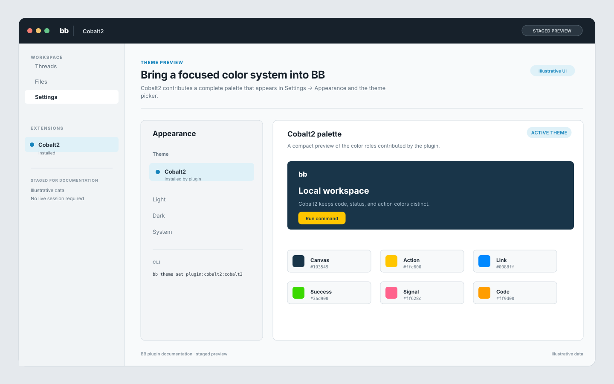

# bb-plugin-cobalt2

Contributes the Cobalt2 color palette to bb.

## Staged preview



This staged preview uses illustrative data. It does not represent a live session.

## Install

From this repository:

```sh
bb plugin install ./packages/bb-plugin-cobalt2
```

The theme appears in Settings → Appearance and can be selected from the CLI:

```sh
bb theme set plugin:cobalt2:cobalt2
```

The plugin has no frontend surface. Its backend entry exists because BB plugin
manifests require one.
