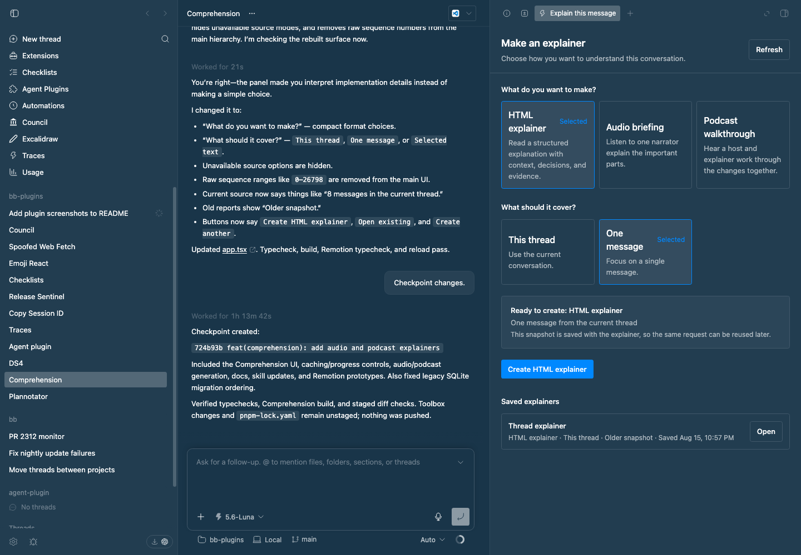

# Comprehension

Comprehension turns a message, a text selection, or a full thread into one of three saved explanation formats: an HTML explainer, an Audio briefing, or a Podcast walkthrough.

## Staged preview

Captured from the running BB application with a real thread and saved explainer.

It provides:

- `Explain this` in the per-message action bar and on selected text.
- `Explainer` in the thread panel's Actions list for a full-thread report.
- A native `comprehension_explain` tool for agents.
- A hidden worker that writes either a standalone Quiet Newsroom HTML document or a spoken transcript.
- OpenRouter TTS for cached narrator and two-speaker audio assets.
- A `::comprehension{id="..."}` directive for opening an explainer from an agent message.

The worker follows the shared `comprehension-report` skill in `skills/`. HTML is shown in a sandboxed iframe. Audio uses a native player and transcript. Podcast walkthroughs use two voices, synchronized captions, chapter controls, and a visual stage in the explainer tab.

The product deliberately has three choices:

- `HTML explainer`: a skimmable document with sections, evidence, and diagrams.
- `Audio briefing`: one narrator with a transcript for listening while returning to work.
- `Podcast walkthrough`: a host and explainer conversation with interactive visual chapters. This combines the podcast and video ideas without rendering a separate MP4 for every request.

Audio and podcast generation require an OpenRouter API key. Add it in the Comprehension plugin settings, or set `OPENROUTER_API_KEY` in the plugin server environment. The key is never sent to the frontend. The default model is `google/gemini-3.1-flash-tts-preview`; the podcast path uses `Charon` for the host and `Sulafat` for the explainer.

Opening the Explainer panel is a setup step; it does not start a worker. Choose the format and source type, inspect the message range, and click the format-specific Generate button when you are ready. The panel keeps saved explainers for the thread, including their format, source range, message boundaries, transcript, and cached audio asset. The same request can be reopened without regenerating it. `Regenerate` intentionally creates a new saved snapshot.

Generation is a durable job. The panel shows the current stage, approximate percentage, step, and elapsed time; it can reconnect to a job after the panel is reopened. `Stop generation` cancels the worker before a report is saved. If the plugin is reloaded while a job is running, the job is marked interrupted instead of remaining indefinitely at an old percentage.

## Comprehension experiment artifacts

- [`docs/plugin-explanation.md`](docs/plugin-explanation.md) is the source-grounded Markdown baseline.
- [`artifacts/comprehension-plugin-explainer.html`](artifacts/comprehension-plugin-explainer.html) is the standalone Comprehension-style report.
- [`remotion/out/comprehension-plugin-brief.mp4`](remotion/out/comprehension-plugin-brief.mp4) is an 84-second narrated Remotion prototype with timed closed captions.
- [`remotion/out/comprehension-plugin-podcast.mp4`](remotion/out/comprehension-plugin-podcast.mp4) is a two-voice podcast-style prototype with speaker-labeled captions and evidence-led visuals.

The narrated video composition lives in `remotion/src/Video.tsx`. The podcast composition lives in `remotion/src/Podcast.tsx`; its two-voice track comes from `remotion/scripts/synthesize-podcast.mjs`. Both scripts use `OPENROUTER_API_KEY` and default to Gemini 3.1 Flash TTS. To render the videos again, run `npm install`, `npm run typecheck`, and either `npm run render` or `npm run render:podcast` from `remotion/`.
