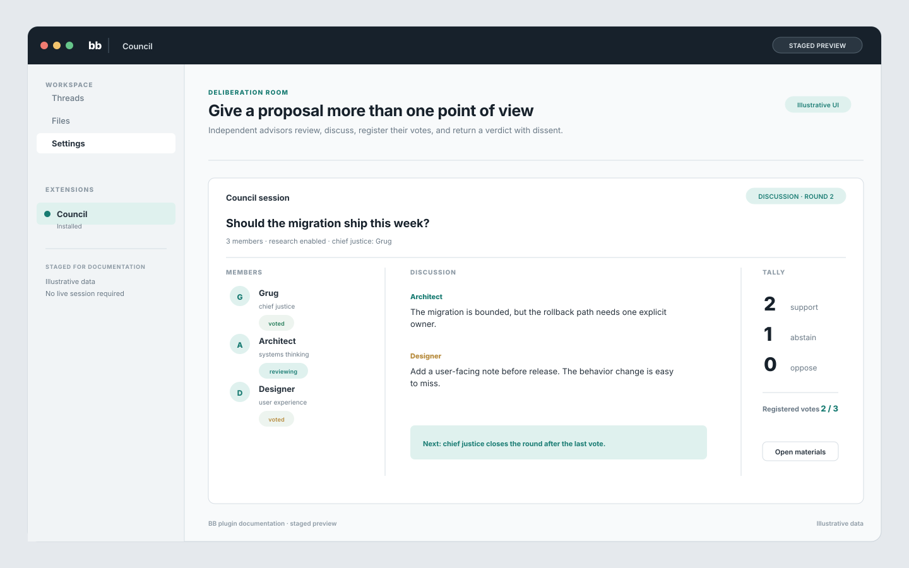

# Council

Council convenes a panel of advisor agents that independently review a proposal, discuss it among themselves, and return a verdict with dissent. One proposal in, one structured deliberation out.

It provides:

- A **Council** panel for managing members and reading session transcripts.
- A native `council_deliberate` tool that blocks while the council deliberates and returns the verdict report.
- A `bb council` CLI (`sessions`, `session`, `convene`) for inspecting and convening from any thread or terminal.
- Three seeded default members on first run; every member is fully editable.

## Staged preview



This staged preview uses illustrative data. It does not represent a live session.

## How a session runs

1. **Consideration** — every enabled member gets its own hidden worker thread and reviews the proposal independently (with workspace research when the setting is on), ending with a `STANCE:` line as their current leaning.
2. **Discussion** — rounds continue with no preset length. Each round, members who have not yet voted see everyone's positions and reply with a comment (or pass). When a member is confident, they call the `council_register_vote` tool to lock in their final stance and leave the discussion. Voted members are skipped; their locked votes show in later digests.
3. **End of debate** — the session ends the moment every active member has registered a vote. A safety cap (setting, default 20 rounds) bounds runaway debates; members who never register by then keep their last recorded stance.
4. **Verdict** — the chief justice writes the final report: verdict, reasoning highlights attributed to members, and dissent/minority views, including how many votes were registered and whether the cap fired.

The tally counts each member's registered final vote (or, if they never registered, their last recorded stance). A transport failure or timeout never flips a member's prior position — it only makes them silent for that round. Members whose spawn fails are marked `recused` in the roster and excluded from the count.

## Members

Members live in the plugin database and are managed in the panel. Each has:

- **Name** shown in transcripts and prompts.
- **Persona** injected as judgment instructions ("You are…"). Write principles and evaluation criteria, not role-play fluff.
- **Provider / model / reasoning level** — leave empty to use the project default. Explicitly chosen values are marked caller-explicit so bb does not silently re-derive them from project defaults.
- **Chief justice** flag — exactly one chief writes the verdict.
- **Enabled** toggle — disabled members are skipped at convene time.

Default members: **Grug** (chief; grugbrain.dev pragmatism — complexity is the enemy, 80/20 solutions, Chesterton's fence), **Architect** (systems thinking, boundaries, trade-offs), **Designer** (user experience, states nobody designed, accessibility). They are seeded once; deleting them is permanent.

## Presets

A preset is a named subset of members for scoping a single convene — a small "eng" panel for code questions, say, while the full council stays available elsewhere. Presets never touch global enable flags; each session snapshots whoever was actually invited, so transcripts stay coherent.

```
bb council presets
bb council preset-add eng Grug Architect
bb council preset-delete eng
bb council convene --preset eng "<proposal>"
```

Members are matched by name or id at save time. Convening with an unknown or empty preset fails loudly rather than silently inviting the wrong panel. The panel's "Start a council conversation" dialog and the `council_deliberate` tool accept the same preset names.

Agents (and you, from any terminal) manage members through the CLI:

```
bb council members
bb council member-add "Skeptic" --persona "<judgment instructions>" [--provider <id>] [--model <model>] [--reasoning <level>] [--chief] [--disabled]
bb council member-set <id> --name ... --persona ... --provider none --chief true|false --enabled true|false
bb council member-delete <id>
```

`--provider/--model/--reasoning none` clears back to project defaults. Deleting the chief automatically promotes the earliest remaining enabled member, so the council always has exactly one.

## Using it

From an agent thread, call the tool:

```
council_deliberate({ proposal: "...", context: "optional diffs/constraints" })
```

`context` is passed to every member as supplementary material. The call blocks for one or more minutes; do not retry it while waiting.

From the panel, use **Start a council conversation**. It does not deliberate inline — it seeds a new thread whose first message instructs the agent to present your proposal to the council via `council_deliberate` and report back the verdict. You watch the work happen, can steer it mid-flight, and keep a conversation going afterward ("what would change if we…?").

From a terminal or thread shell:

```
bb council sessions
bb council session <id>
bb council delete <id>
bb council convene "<proposal>"
```

`bb council convene` blocks and prints its session id with the report. Cancel it and the session is recorded as cancelled; member threads are stopped either way.

Deleting a session removes its transcript, turns, and roster permanently — from the panel (Delete button on each session card) or via `bb council delete`.

## Panel

The session view has three tabs:

- **Overview** — verdict, phase spine (consideration → discussion rounds → verdict), tally with each member's stance across rounds (▲ marks changes), and top verified materials.
- **Members** — pick a member to see their full arc: the research calls they made (commands run, files read), their consideration summary, every discussion round, their registered final vote, and their verdict if they are chief.
- **Materials** — the evidence ledger: every artifact any member touched, what it showed, and who cited it.

Research artifacts are captured from each member thread before it is archived; they never affect the deliberation itself.

## Settings

| Setting | Default | Meaning |
| --- | --- | --- |
| Safety cap: max discussion rounds | 20 | Upper bound on debate; the session normally ends when all members register their votes |
| Per-response timeout (seconds) | 240 | Wait per member response before recusing them; also bounds research time |
| Member research | workspace tools | During consideration, members may read the workspace and run quick read-only checks (`off` restores facts-presented-only judging) |
| Max council members | 7 | Guard rail on panel-created members |

Research makes deliberations slower (minutes instead of ~half a minute) but grounds verdicts in verified repo facts instead of plausible guesses. Discussion and verdict phases are always tool-free so they stay fast and focused on the collected evidence.

## Behavior notes

- Member threads are hidden, stopped, and archived on every exit path, including failures, cancellation, and plugin dispose.
- Failed/cancelled sessions keep their transcript and an error message; nothing stays stuck in `running`.
- Sessions, turns, rosters, and tallies persist in the plugin SQLite store and survive reloads.
